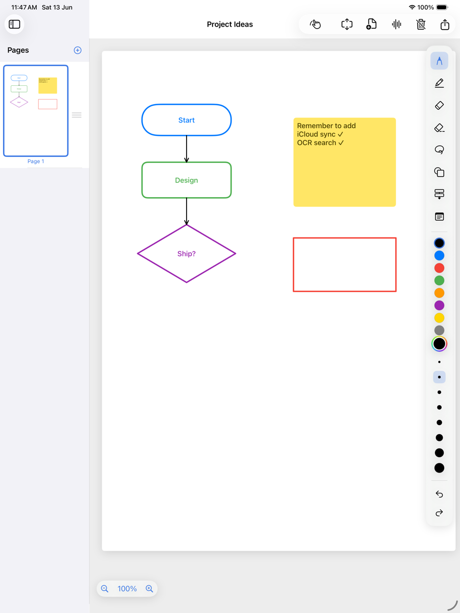
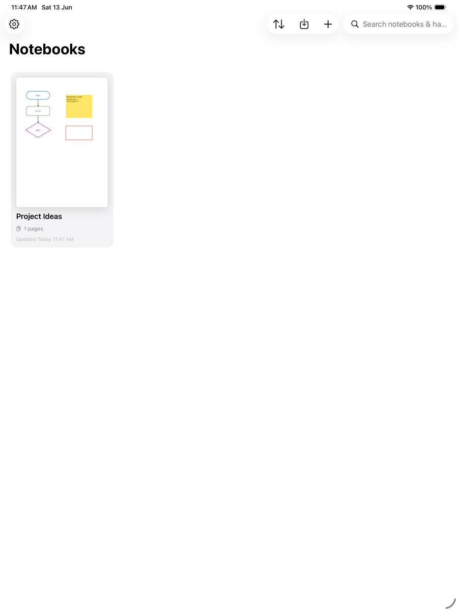

# NotePad — Native iPad Note-Taking App

A clean, native iPad note-taking app optimized for Apple Pencil, with a
**GoodNotes-style** editor: a compact horizontal tool bar, white-paper or
blackboard templates, handwriting, shapes & flowcharts, PDF annotation, and
notebook organization with tags — all synced across devices via iCloud.

Published on the App Store as **Tertiary NotePad**, by **Tertiary Infotech
Academy Pte Ltd**.


<p align="center">
  
  &nbsp;&nbsp;
  
</p>

## Features

### Editor (GoodNotes-style)
- **Compact horizontal tool bar** at the top: tools, color, width, template,
  add-page, clear/delete, and undo/redo — all in one clean, icon-centric row.
- **Apple Pencil** — PencilKit canvas with pressure, tilt and low latency.
  **Palm rejection**: scrolling is suspended while the Pencil draws.
- **Pencil draws, finger scrolls** (the GoodNotes model); a single finger pans
  and two fingers always pinch-zoom. Finger-drawing is an opt-in toggle/setting.
- **Tools** — pen (8 widths), highlighter, pixel & object erasers, plus a
  **color dropdown** with 26 swatches and a custom color picker.
- **Shapes** — rectangle, circle, triangle, diamond, line, arrow as an editable
  **vector overlay** (stroke / fill / width).
- **Flowcharts** — process, decision, start/end nodes and connectors that **snap
  to nodes** and re-route automatically when a node moves.
- **Inline text** — type **directly into** sticky notes and flowchart nodes with
  a multi-line editor; pick a **background color** (text auto-contrasts), tap a
  node to edit, tap away to commit. Node text is centered.
- **Lasso** — loop around **multiple** handwriting strokes to move / delete /
  copy (native PencilKit); tap a shape to select it for an on-canvas popup
  (delete · duplicate · change color) and drag to move.

### Templates & appearance
- **White paper or blackboard** templates, applied **notebook-wide**. Switching
  recolors existing ink (dark ink ⇄ white chalk) and new pages inherit it.
- **Adaptive light/dark** — ink renders literally on the page (and in
  thumbnails), while chrome and the canvas surround follow the system theme.
- **Page footer** — "Page N · date & time" at the bottom-right (toggleable).

### Pages
- **Continuous paging** — pull firmly past the top/bottom edge and release to add
  a page above/below; or use the **Add Above / Add Below** menu.
- **Fit-to-width on open**, scroll to the top of the first page; re-fits on
  rotation. **Double-tap** a page to zoom in / out.
- **Thumbnail sidebar** — jump to a page, **multi-select to delete**, and
  **drag-to-reorder**; thumbnails render the real content in the page's colors.
- **Infinite canvas** — extend a page in A4-height increments.

### Organization & sync
- **Dashboard** — grid of notebooks with live cover thumbnail, page count,
  dates, instant search (incl. handwriting), and sort.
- **Tags** — assign multiple tags (e.g. Physics, Math, Computing) to a notebook;
  filter the dashboard by tag. Tags show as chips under the title.
- **Nested notebooks** — sub-notebooks via a self-referential relationship.
- **iCloud sync** — notebooks and pages auto-sync via CloudKit (private database).
- **Handwriting / OCR search** — Vision text recognition indexes pages so search
  finds words inside your handwriting and shapes.
- **Auto save** — every change is debounced and persisted; no save button.

### Import / export / media
- **PDF annotation** — import a PDF as annotatable pages and mark it up.
- **Export** — page to PNG / JPG / PDF; whole notebook to a combined PDF.
- **Notebook sharing** — export a full notebook (pages, PDF backgrounds, voice
  memos) to a portable `.notebook` file and import it elsewhere.
- **Audio notes** — record, play back, and delete voice memos per notebook.

### iPad-native polish
- **Keyboard shortcuts** — Undo ⌘Z, Redo ⌘⇧Z, New notebook ⌘N, Settings ⌘,.
- **Pointer hover effects** on toolbar and cards; **VoiceOver labels** on all
  icon-only controls (per Apple's iPad Human Interface Guidelines).

## Tech Stack

- **SwiftUI** + **PencilKit** + **PDFKit** + **Vision** (OCR) + **AVFoundation** (audio)
- **SwiftData** persistence with **CloudKit** iCloud sync
- **Swift 6** language mode with **complete strict concurrency**
- **Observation** framework (`@Observable`), `@MainActor` isolation
- **MVVM** + **Repository** pattern
- iPadOS **18+**

## Architecture

```
SwiftUI Views ──> ViewModels (@Observable) ──> Repositories ──> SwiftData ──> CloudKit
                       │
                       ├─> AutoSaveService (debounced save + Vision OCR indexing)
                       ├─> ExportService / NotebookArchiveService (PDF, PNG, .notebook)
                       └─> AudioRecorder / PDFImport services

Editor = zoom/pan UIScrollView
         └─ vertical stack of PageContainerViews (height = N × A4)
              ├─ background image  (imported PDF page)
              ├─ PKCanvasView      (handwriting / drawing, pencil-only)
              └─ ShapeOverlayView  (vector shapes, flowchart connectors, sticky notes)
```

The gesture conflict between drawing, panning and zooming is resolved with a
finger-only scroll pan and `drawingPolicy = .pencilOnly`: the Apple Pencil always
draws (and scrolling is suspended mid-stroke for palm rejection), a single finger
scrolls, and two fingers pinch-zoom — while each canvas's internal scrolling is
disabled so the single outer scroll view owns pan/zoom.

## Project Layout

```
App/          App entry (CloudKit container), root view, theme, entitlements
Models/       Notebook, Page, AudioNote (SwiftData), CanvasItem/Shape (Codable overlay)
ViewModels/   Dashboard / Notebook / Editor view models, tool + canvas controllers
Services/     Repositories, AutoSave (+OCR), Export, NotebookArchive, PDFImport,
              TextRecognition (Vision), Audio (AVFoundation), PageRenderer
PencilKit/    CanvasContainerView (scroll + zoom host)
Components/   PageContainerView, ShapeOverlayView, ShapePath, ThumbnailView
Views/        Dashboard, Notebook, Editor, Sidebar, Toolbar, Settings, Export, AudioNotes
```

## Building

The Xcode project is generated from `project.yml` with
[XcodeGen](https://github.com/yonsm/XcodeGen) (the `.xcodeproj` is **not** checked in).

```bash
brew install xcodegen      # once
xcodegen generate          # creates NotePadApp.xcodeproj
open NotePadApp.xcodeproj
```

Select an **iPad (iPadOS 18+) simulator** or a physical iPad and press **Run**.

### Command-line build

```bash
xcodegen generate
xcodebuild -project NotePadApp.xcodeproj -scheme NotePadApp \
  -sdk iphonesimulator -destination 'generic/platform=iOS Simulator' \
  CODE_SIGNING_ALLOWED=NO build
```

## Continuous Integration

`.github/workflows/build.yml` runs on every push / PR to `main`: it installs
XcodeGen, generates the project, and compiles for the iOS Simulator on a macOS runner.

## Roadmap

**Shipped:** GoodNotes-style top toolbar · handwriting with pressure/tilt ·
shapes & flowcharts with snapping connectors · white / blackboard templates
(notebook-wide, with ink recolor) · inline multi-line text + element background
colors · multi-stroke lasso · iCloud (CloudKit) sync · handwriting / OCR search ·
sticky notes · audio (voice-memo) notes · infinite extendable canvas · PDF import
& annotation · `.notebook` sharing · notebook tags & filtering · pull-to-add
pages · double-tap zoom · multi-select / drag-reorder pages · iPad HIG polish
(keyboard shortcuts, pointer hover, VoiceOver). Submitted to the App Store.

**Next:** real-time collaboration (live CKShare co-editing — current sharing is
file-based) · handwriting-to-text conversion · lined / grid paper templates ·
web companion.

---

<p align="center">Powered by <strong>Tertiary Infotech Academy Pte Ltd</strong></p>
